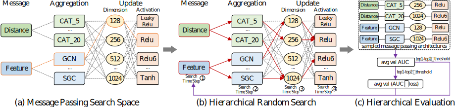

# AdaGramp

- AdaGramp can adaptively design a appropriate message passing architecture according to data set distribution for anomaly detection.

- The framework of AdaGramp is as follows:

<br>
<div align=left>  </div>


## Install based on Ubuntu 16.04

- **Ensure you have installed CUDA 11.0 before installing other packages**

**1.Python environment:** recommending using Conda package manager to install

```python
conda create -n adagramp python=3.7
source activate adagramp
```

**2.Python package:**
```python
torch == 1.13.1
torch-geometric == 2.3.0
torch-cluster == 1.6.1
torch-scatter == 2.1.1
torch-sparse == 0.6.17
torch-spline-conv == 1.2.2
faiss == 1.7.3
```
## Run the Experiment
**1.Performance test with the optimal message passing architecture designed by AdaGramp**
```python
run performance_test.py
```

**2.Search new message passing architectures from scratch using AdaGramp**
```python
run hierarchical_random_search.py
```
